# How to Configure VS Code to Easily Develop Airflow DAGs with Docker
By default Vscode does not have access to Airflow running inside docker container. This setup will help you overcome import errors in the code editor and enable auto completion for your code for smooth dag development.

## Prerequisite

Make sure Docker Desktop is running.

## Step 0: Install the ***Dev Containers*** Visual studio code extension
Open vs code and navigate to the extension tab, search for the Dev Containers extension, open and click on install

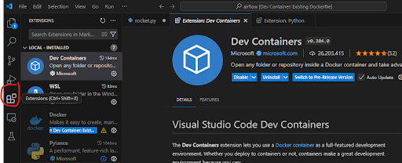

## Step 1: Create a Dockerfile
Create a Dockerfile in your airflow folder directory and write the following command inside (change the ```<your airflow version>```) to the airflow version you are using

```
FROM apache/airflow:<your airflow version>
```

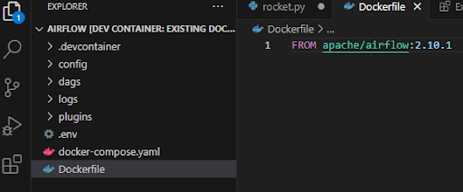

## Step 2: Open vscode in the dev container
Open vscode in the dev container by clicking on the remote window icon


Select Reopen in container

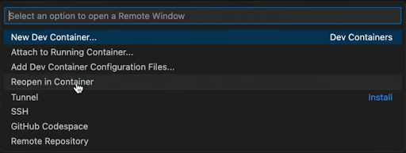

Select ```From ‘Dockerfile’```

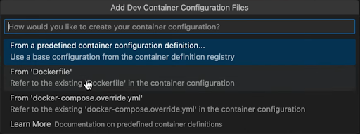

Then select OK

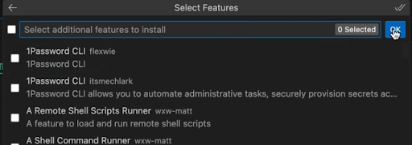

You should now have your vscode running in Dev Container

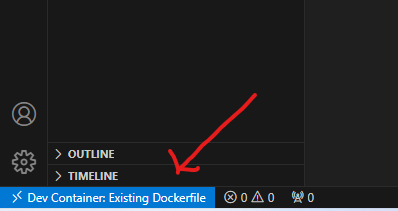

## Step 3: Setup Intellisense in the Dev Container
Install the Python microsoft extension for vscode:
Go to the extensions tab, search for Python, click on it and click on install.

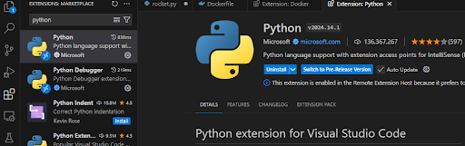

**Well done, you have successfully setup your vscode for airflow dags development in docker**

Since you are now in the Dev Container, all your terminal commands will be executed in the dev container as shown below that you are in the Dev Container workspace.

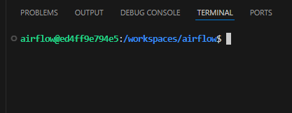

### How to execute command on the local machine shell while connected to the remote Dev Container

If you want to execute commands on your host machine, you need to do the following

```ctr+shift+p on Windows or cmd+shift+p  on mac```

On the pop up window, search for ```create new integrated terminal (Local)``` and click on it:

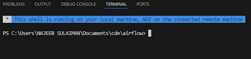

As you can see, all your commands in this new terminal will now be executed on the host machine.

### How to disconnect from the Dev Container

Click on the remote connection icon

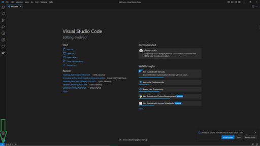

And click on close remote connection

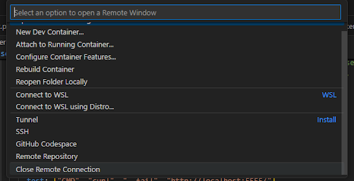

**The End**