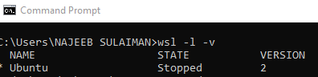

# Airflow Installation From PyPi
## Prerequisites:
- Installation of VSCode v1.8 or above
- Python 3
- Installation of WSL 2 (For Windows OS)

***If you are a macOS user, skip the instructions below and start from Step 0***

## For Windows OS user
Follow all the steps below to setup a linux environment, if you are a Windows OS user.

### Check if WSL is installed
run the following command in PowerShell or Windows Command Prompt
```
wsl -l -v
```
You should have something similar to the below if you have WSL installed



### If you don’t have wsl installed, follow the below steps:
Prerequisites:
- You must be running Windows 10 version 2004 and higher (Build 19041 and higher) or Windows 11 to use the commands below. If you are on earlier versions please see the manual install page [here](https://learn.microsoft.com/en-us/windows/wsl/install-manual).

You can install everything you need to run WSL with a single command. Open PowerShell or Windows Command Prompt in administrator mode by right-clicking and selecting "Run as administrator", enter the following command, then restart your machine:
```
wsl --install
```
This command will enable the features necessary to run WSL and install the Ubuntu distribution of Linux.

Check if WSL is now installed using the ```wsl -l -v``` command

### Directing to Linux Environment (WSL)

Open VS Code and connect to WSL as Shown below:


Click on connect to WSL


## Step 0: Open a new terminal
Go at the top bar of Visual Studio Code -> Terminal -> New Terminal


## Step 1: Create a folder airflow (or any name you want)


## Step 2: Go into the airflow folder
```
cd airflow
```

## Setting up Environment
Follow the instructions provided below after creating the folder.

## Step 3: Create a Python Environment
Create a Python Environment inside the folder with these commands:

```
sudo apt-get update
sudo apt-get install python3-venv
```
```
python3 -m venv <your virtual env name>
```
## Step 4: Activate the Environment
```
source <virtualenvname>/bin/activate
```
If your folder is not open already, click on open folder and search for your folder name, then click OK twice


## Step 5: Install Apache Airflow packages
Run the following command to install Airflow

```
pip install "apache-airflow[celery]==2.8.1" --constraint "https://raw.githubusercontent.com/apache/airflow/constraints-2.8.1/constraints-3.8.txt"
```

Please refer to the documentation [here](https://airflow.apache.org/docs/apache-airflow/stable/installation/installing-from-pypi.html) if you prefer to instal the latest airflow version.

## Step 6: Setting up environment variables and Python Path

Navigate to your virtual environment and run ```pwd``` in your Terminal to get the current directory.


Go to bin folder inside the virtual environment created and open the activate file


Edit the activate file by adding the following commands at the end of the lines and save:

```
export AIRFLOW_HOME=<virtualenvpath> 
# APP_ENV variable is for setting up airflow environment - local,development or production
APP_ENV=local
export APP_ENV
```


After editing the bin, deactivate and reactivate the virtual environment by using the following command:

``` 
deactivate 
```
```
source <virtualenvname>/bin/activate
```

## Step 7: Select your Python Interpreter
Press CTRL/CMD + SHIFT + P in VSCode. It will open up the command palette. Type Select Interpreter from the command palette


Select the python interpreter which is inside the virtual environment. In this example /airflow/bin/python (1st option and it is the recommended)


## Step 8: Initialize the database

```
airflow db migrate
```

## Step 9: Create a user

```
airflow users create --role Admin --username admin --email youremail@gmail.com --firstname admin --lastname admin --password admin
```

You can change the youremail@gmail.com in the command to your actual email and you can also change other arguments.

## Step 10: Confirm the created user

```
airflow users list
```


## Step 11: Launch the Webserver

```
airflow webserver
```

## Step 12: Launch the Scheduler

Open new terminal and check if the environment is activated; if not, activate it by ```source <venvname>/bin/activate ``` and run the following command:

```
airflow scheduler
```

## Step 13: Access airflow from the web browser

Open web browser and enter http://localhost:8080/. The following window will be displayed which confirms successful local airflow installation


Login with the username and password created earlier:

Username: admin

Password: admin


**Congratulations! You have successfully installed Airflow**

## Step 14: Setup dags folder
Create a dags folder as shown below. Also verify the dags folder path inside airflow.cfg is correct (By default “[AIRFLOW_HOME]/dags”)

```
mkdir dags
```


Verify the dags folder path is correctly set in airflow.cfg file


## Step 15: Enable test connection if needed

To be able to test connections from the airflow UI, enable test_connection in **airflow.cfg file** as shown below. By default, it is disabled. Edit airflow.cfg file and change the test_connection variable from Disabled to Enabled then save. Restart the webserver and scheduler after performing this change for it to take effect.


**The End**

## Miscellaneous

To stop the webserver and scheduler, run the following commands:

```
fuser -k 8080/tcp (to kill webserver)
```
```
fuser -k 8793/tcp (to kill scheduler)
```

Replace the 8080 and 8793 with the actual port your webserver and scheduler are running on respectively.

**Reach out if you encounter any error while setting this up**