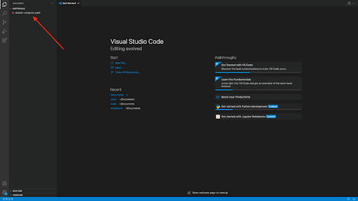

# Airflow Installation Using Docker
## Prerequisites:
First, make sure you have installed Docker Desktop and Visual Studio code. If not, take a look at these links:

[Get Docker](https://docs.docker.com/get-docker/)

[Get Visual Studio Code](https://code.visualstudio.com/download)

The minimum memory(RAM) required by Docker to get Airflow up and running is at least 4gb. You can check if you have enough memory by running this command

```
docker run --rm "debian:bookworm-slim" bash -c 'numfmt --to iec $(echo $(($(getconf _PHYS_PAGES) * $(getconf PAGE_SIZE))))'
```


## Step 0: Open your Terminal
Open your Terminal(Mac) or GitBash (windows) and change directory to your Documents folder

## Step 1: Create a folder
Create a folder airflow (or any name you want) in your Documents folder and change directory to the folder
```
mkdir airflow
```
```
cd airflow
```

## Step 2: Fetch docker-compose.yaml
Fetch the docker-compose.yaml file by running the below curl command

```
curl -LfO 'https://airflow.apache.org/docs/apache-airflow/2.10.1/docker-compose.yaml'
```

## Step 3: Open Visual Studio Code
Open Visual Studio Code by typing the command 
```
code .
```
You should have something like this



## Step 4: create a .env file
In the same directory as the docker-compose.yml file, create a new file named ```.env``` (don't forget the dot before env)

## Step 5: Add AIRFLOW_UID to .env
In this file add the following line and save the file
```
AIRFLOW_UID=50000
```


## Step 6:  Open a new Terminal
Go at the top bar of Visual Studio Code -> Terminal -> New Terminal


## Step 7: Run database migrations
In your new terminal at the bottom of Visual Studio Code, run the following command to run database migrations and create the first user account

```
docker compose up airflow-init
```

## Step 8: Start all services
Run this command to start all services
```
docker-compose up -d
```


You will see many lines scrolled, wait until it's done. Docker is downloading Airflow to run it. It can take up to 5 mins depending on your connection speed. If Docker raises an error saying it can't download the docker image, ensure you are not behind a proxy/vpn or corporate network. You may need to use your personal connection to make it work. At the end, you should end up with something like this


## Step 9: Check containers status
Open a new terminal and do ```docker ps``` All your containers status should be healthy as shown below


## Step 10: Access web interface
Open your web browser and go to localhost:8080, you should see the login page as shown below


Login with 
```
username: airflow 
password: airflow
```

**Well done, you've just installed Apache Airflow with Docker! 🎉**
